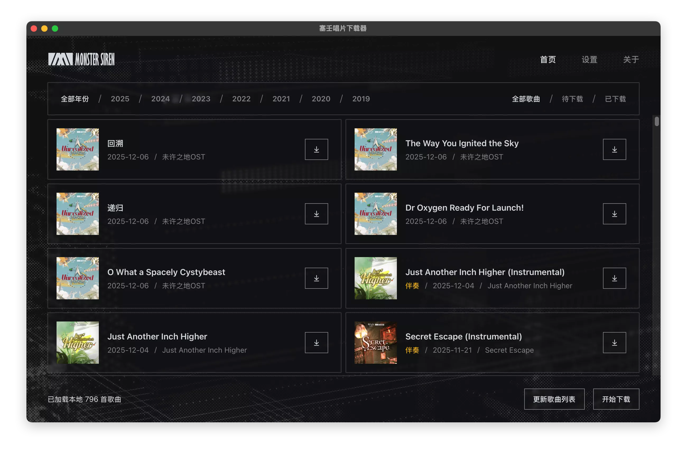

<div align="center">
<h3 align="center">明日方舟塞壬唱片下载器</h1>
<p align="center">从塞壬唱片官网下载原汁原味的音乐专辑，并借助网易云音乐 API 补全缺失的元数据</p>


[](https://github.com/nuthx/siren-downloader/releases/latest)


</div>

## 安装

在 [Release](https://github.com/nuthx/siren-downloader/releases/latest) 页面下载最新版本，支持 Windows 与 macOS 平台

在早期 Windows 10 及以前的系统中，需要手动安装 WebView2 运行时，请在 [这里](https://developer.microsoft.com/zh-cn/microsoft-edge/webview2) 下载安装

在 masOS 上可能会出现“已损坏”或“打不开应用程序”的问题，请参考 [常见问题](#常见问题)

## 配置

下载歌曲前需在设置中预填下载路径，并安装 FFmpeg 工具

Windows 支持一键下载安装 FFmpeg

macOS 需要手动安装 [Homebrew](https://brew.sh) 并通过 `brew install ffmpeg` 安装 FFmpeg 工具

安装完成后，点击“查看版本”可正确显示 FFmpeg 版本，则表示安装成功

## 使用说明

程序支持下载单一歌曲或批量下载所有歌曲，批量下载时会根据设置中“下载伴奏”选项决定是否跳过伴奏歌曲

若开启“下载歌词”选项，则下载歌曲时会同步从塞壬唱片官网获取歌词，并下载至同目录下 LRC 文件

塞壬唱片官网提供了 MP3 与 WAV 两种格式的音乐文件，当歌曲为 WAV 格式时，会自动转换为 FLAC 格式

专辑封面来自于网易云音乐，若封面尺寸过大，会先缩放至 1500x1500 像素后再写入歌曲文件

## 常见问题

#### 1. macOS 运行提示“未打开”、“已损坏”、或“移到废纸篓”等弹窗

由于缺少签名，导致无法直接打开下载的应用程序，需手动移除应用的安全隔离属性

将 `塞壬唱片下载器` 拖入到 `Application` 文件夹后，打开终端，输入以下命令：

```bash
sudo xattr -dr com.apple.quarantine /Applications/塞壬唱片下载器.app
```

若程序不在 `/Applications` 目录下，请将 `/Applications/塞壬唱片下载器.app` 替换为实际路径

进入“系统设置” -> “隐私与安全性”，滑动至最底部，在 `已阻止 塞壬唱片下载器 以保护Mac` 中点击“仍要打开”

#### 2. 无法下载 FFmpeg

Windows 平台可从 [官网](https://ffmpeg.org/download.html) 手动下载 FFmpeg 二进制文件，重命名为 `ffmpeg.exe` 并复制到 `%APPDATA%\com.nuthx.siren-downloader\bin` 目录下

macOS 平台若下载速度较慢，可通过优化网络环境加速下载

#### 3. 如何定义歌曲的“已下载”状态

歌曲下载成功后，会写入“已下载”状态到配置目录中

歌曲文件移动或删除时，不影响程序中显示的下载状态

#### 4. 下载时报错“网易云封面为空”

部分专辑在塞壬唱片官网与网易云音乐中的专辑名称不同，需要在在配置文件层面进行匹配

最新版本已经同步匹配了所有有差异的专辑名称

当有新的专辑发布且专辑名称不同时，则会报错“网易云封面为空”，更新软件至最新版本后即可解决

## 致谢

[塞壬唱片-MSR](https://monster-siren.hypergryph.com/)

## 免责声明

本工具仅用于学习与技术交流，所有音乐版权均归原作者及相关版权方所有，任何下载内容不得用于商业用途

本工具中使用的塞壬唱片及相关 LOGO 均为其合法拥有者的注册商标或版权标识，仅用于标识目的，归相关版权方所有
